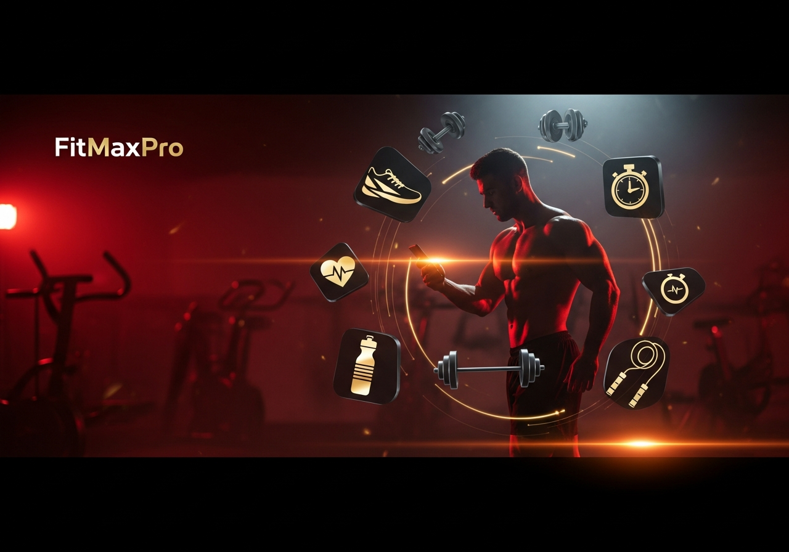
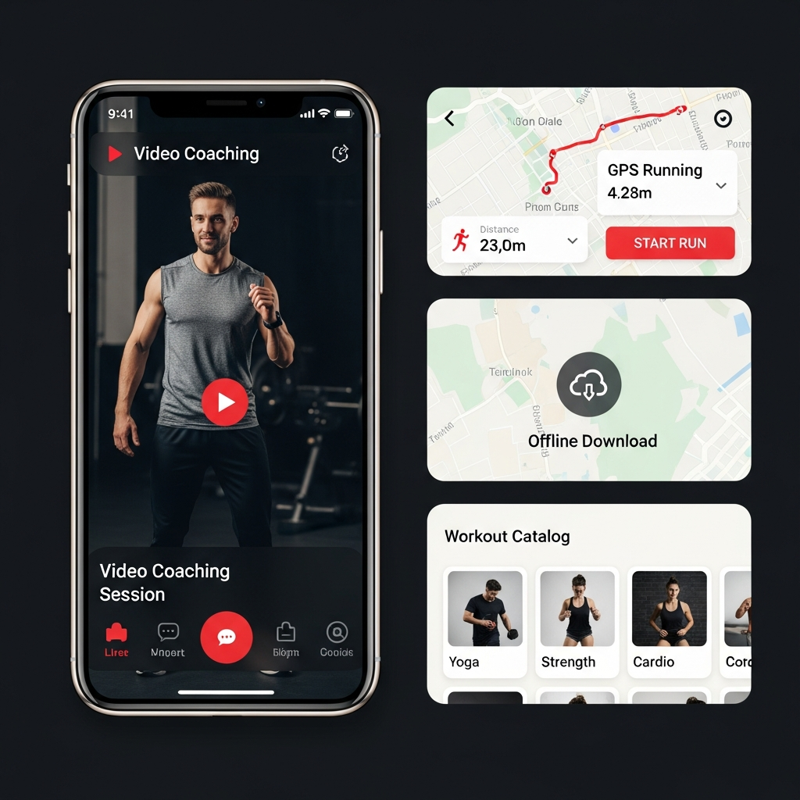
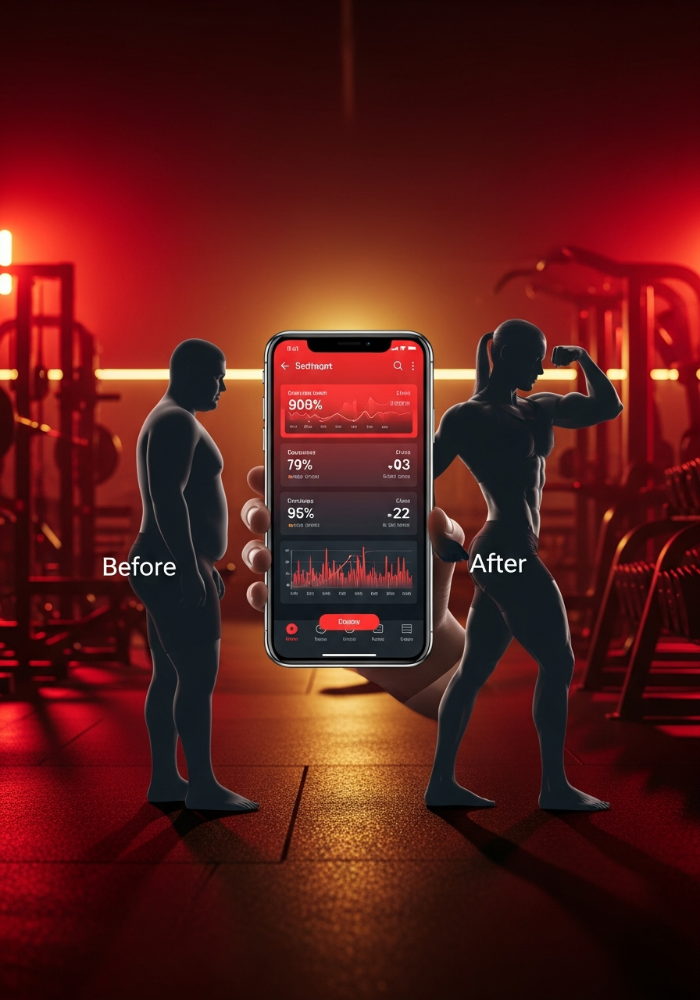

# 📸 Guide des Captures d'Écran FitMaxPro

## URLs des Images Générées par IA

### 1. Hero Banner (1536x1024)

- Usage: Page d'accueil, publicités Facebook/Instagram

### 2. Features Showcase (1024x1024)

- Usage: Posts Instagram, présentation des fonctionnalités

### 3. Transformation (1024x1536)

- Usage: Stories, publicités verticales

### 4. Social Story (1024x1536)

- Usage: Stories Instagram/Facebook, TikTok

---

## Captures d'Écran de l'Application

Pour capturer les écrans de votre application en direct, visitez ces URLs :

### Pages Principales

1. **Landing Page (Accueil)**
   - URL: https://fitmax-gains.preview.emergentagent.com/
   - Description: Page d'accueil avec présentation de l'app

2. **Page de Connexion**
   - URL: https://fitmax-gains.preview.emergentagent.com/login
   - Description: Formulaire de login avec option Google

3. **Dashboard**
   - URL: https://fitmax-gains.preview.emergentagent.com/dashboard
   - Description: Tableau de bord utilisateur avec points, abonnement

4. **Catalogue des Séances**
   - URL: https://fitmax-gains.preview.emergentagent.com/workouts
   - Description: Liste de 72+ séances avec filtres

5. **Détail d'une Séance**
   - URL: https://fitmax-gains.preview.emergentagent.com/workout/workout_9a463f155d57
   - Description: Page détaillée avec exercices et vidéos

6. **Plans Nutritionnels**
   - URL: https://fitmax-gains.preview.emergentagent.com/supplements
   - Description: Suppléments et plans de repas

7. **Running**
   - URL: https://fitmax-gains.preview.emergentagent.com/running
   - Description: Tracker GPS avec stats

8. **Live Coaching**
   - URL: https://fitmax-gains.preview.emergentagent.com/live
   - Description: Sessions live et demandes

9. **Récompenses**
   - URL: https://fitmax-gains.preview.emergentagent.com/rewards
   - Description: Système de points et défis

10. **Ma Progression**
    - URL: https://fitmax-gains.preview.emergentagent.com/my-progress
    - Description: Statistiques personnelles

11. **Hall of Fame**
    - URL: https://fitmax-gains.preview.emergentagent.com/hall-of-fame
    - Description: Classement des meilleurs membres

12. **Tarifs**
    - URL: https://fitmax-gains.preview.emergentagent.com/pricing
    - Description: Plans d'abonnement

13. **Admin Panel**
    - URL: https://fitmax-gains.preview.emergentagent.com/admin
    - Description: Panneau d'administration (20+ onglets)

---

## Comptes de Démonstration

Pour faire des captures avec du contenu :

| Type | Email | Mot de passe |
|------|-------|--------------|
| Admin | admin@fitmaxpro.com | admin123 |
| User | testuser@test.com | password123 |

---

## Conseils pour les Captures

1. **Résolution recommandée**: 1920x1080 (desktop) ou 390x844 (mobile)
2. **Mode sombre**: L'app utilise un thème sombre pour un meilleur rendu
3. **Connectez-vous** avant de capturer les pages internes
4. **Mobile**: Utilisez les DevTools du navigateur (F12 → mode responsive)

---

## Outils Recommandés

- **Navigateur**: Chrome ou Firefox
- **Extensions**: 
  - GoFullPage (capture page entière)
  - Awesome Screenshot
- **Mobile**: Capacitor pour builds natifs
